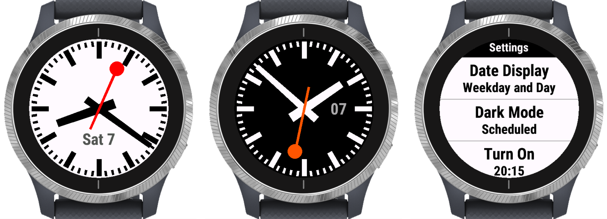
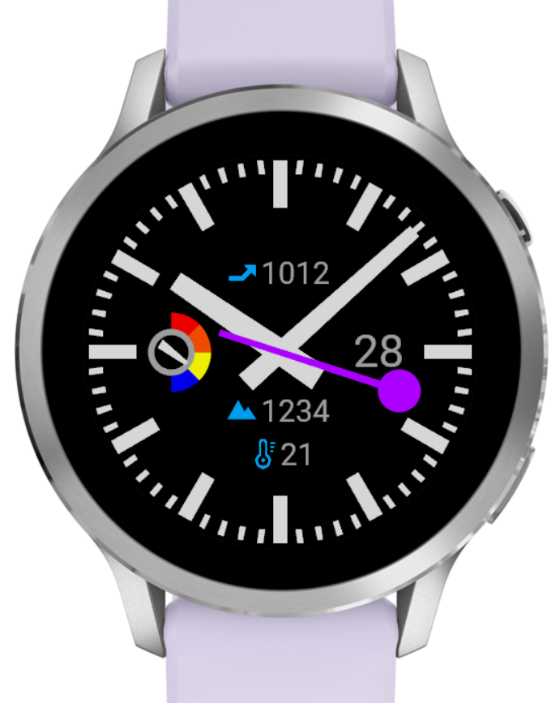

<table border="0" cellpadding="0" cellspacing="0">  <tr>
    <td width="33%" valign="top">
      
    </td>
    <td valign="top">
      <p>
        More "Configurable Clutter"<br/>A newer watch (Venu® 4 41mm, picture from the simulator) showing some of the newer indicators for stress, pressure, altitude and temperature.<br/>
        The altitude and temperature values are in the units set in the system (°C or °F and m or ft) and for the pressure unit there is a setting in the watch menu (since there isn't a system setting).
      </p>
    </td>
  </tr>
</table>

# Swiss Railway Clock - An analog watchface for Garmin smartwatches

- This analog watchface is an implementation of the iconic [Swiss railway clock] design for Garmin smartwatches, with an always-on second hand on watches with a MIP display;
- The operation differs from the original Swiss railway clock in that the second hand ticks like that of a quartz watch, rather than sweeps, and it does not pause at 12 o'clock;
- On-device settings (a settings menu on the watch itself) allow the configuration of a battery level indicator (a classic battery shaped one or a modern one), date display, dark mode, 3D effects, a "Move Bar" and various other options. The "Configurable Clutter" clip above shows some of them, section [Settings](#settings) has the complete list and sections [Adding a new Indicator](#adding-a-new-indicator) and [Adding a new Application Setting](#adding-a-new-application-setting) explain how you can add your own;
- On watches with an AMOLED display, the background is always black and there are two independent brightness settings, replacing the contrast and dark mode options of MIP watches. Always-on (low-power) mode uses the darkest dimmer level[^1]. It is not possible to show the second hand in always-on (low-power) mode of AMOLED watches;
- On recent watches with a touch screen, it is possible to detect touch screen presses (touch and hold). This is used for a little gimmick to change the hour and minute hands and draw just their outlines for a few seconds after a screen press, so any indicator that is covered by the hands becomes readable (supported from the Forerunner 255, 955, fēnix 7 and 8 series, Enduro 2 and 3 and all AMOLED watches).

This program reflects the progress of my ongoing journey to master [Monkey C] and the Garmin [Connect IQ ecosystem] to create an analog watchface. What started as a simple program has grown into a complete application over time, with numerous features and support for all newer Garmin watch models. I am sharing it with developers to showcase what I've learned, in the hope that it will help others grasp the relevant programming concepts more quickly than I did, and to perhaps get some feedback on what could be done better and how. This is an educational and non-commercial project and is not intended to compete with any licensed application of the original Swiss railway clock design, which belongs to the Swiss Federal Railways (SBB). As such, it is not published in the Garmin Connect IQ store.

[^1]: Newer AMOLED watches have burn-in protection requirements, which are easily and quite naturally addressed with the concept of a brightness setting. A few older AMOLED watches with more complex burn-in protection requirements are not supported.

### Settings

Details of the available on-device settings and their options. The settings differ slightly between the three classes of supported devices. Use the [Compatible devices](#compatible-devices) table below to find out which architecture each device uses.

| Name | Values* | Description | Architecture |
| --- | --- | --- | ---|
| Battery&nbsp;Level | Classic<br/>Modern<br/>Classic&nbsp;Warnings<br/>Modern&nbsp;Warnings<br/>**Off** | _Classic_ refers to a battery-shaped indicator with colored bars for the remaining battery life. _Modern_ shows just a colored solid circle. With _Warnings_, the indicator is only displayed if the remaining battery life is less than the warning threshold of 40%. If the battery life is less than 10% the color is red, if less than 20% it is orange, else green. | Legacy<br/>Modern<br/>Amoled |
| Battery&nbsp;Percentage | On<br/>**Off** | Adds the battery life as a percentage to the left of the battery indicator. | Legacy<br/>Modern<br/>Amoled |
| Battery&nbsp;Days** | On<br/>**Off** | Adds the remaining battery life in days to the right of the battery indicator. | Legacy<br/>Modern<br/>Amoled |
| Date&nbsp;Display | Day&nbsp;Only<br/>Weekday&nbsp;and&nbsp;Day<br/>**Off** | Displays the date, either as a two digit number for the day of the month or the abbreviated weekday and day of the month. | Legacy<br/>Modern<br/>Amoled |
| Alarms | **On**<br/>Off | Shows an alarm symbol when an alarm is set on the device. | Legacy<br/>Modern<br/>Amoled |
| Notifications | On<br/>**Off** | Shows a notification symbol when there are active notifications. | Legacy<br/>Modern<br/>Amoled |
| Phone&nbsp;Connection | **On**<br/>Off | Shows a Bluetooth symbol on the 6 o'clock tickmark when the phone connection is established. | Legacy<br/>Modern<br/>Amoled |
| 1st&nbsp;Complication | Heart&nbsp;Rate<br/>Recovery&nbsp;Time**<br/>Calories<br/>Steps<br/>Floors&nbsp;Climbed**<br/>Altitude<br/>Pressure**<br/>Temperature**<br/>**Off** | Shows the selected indicator, usually at 12 o'clock:<br/>- Heart rate in beats per minute (bpm);<br/>- Time to recovery from the last activity, in hours;<br/>- Calories burned so far for the current day in kilocalories (kCal);<br/>- Step count since midnight for the current day in number of steps;<br/>- The number of floors climbed for the current day;<br/>- The altitude above mean sea level in meters (m) or feet (ft);<br/>- The atmospheric pressure value in the selected pressure unit and an arrow showing the pressure trend over the last 6 hours;<br/>- The temperature measured by the watch in degrees celcius (°C) or fahrenheit (°F). | Modern<br/>Amoled |
| 2nd&nbsp;Complication | Heart&nbsp;Rate<br/>Recovery&nbsp;Time**<br/>Calories<br/>Steps<br/>Floors&nbsp;Climbed**<br/>Altitude<br/>Pressure**<br/>Temperature**<br/>**Off** | Shows the selected indicator, usually at 6 o'clock. | Modern<br/>Amoled |
| 3rd&nbsp;Complication | Heart&nbsp;Rate<br/>Recovery&nbsp;Time**<br/>Floors&nbsp;Climbed**<br/>Pressure**<br/>Temperature**<br/>Stress**<br/>**Off** | Shows the selected indicator, usually at 9 o'clock.<br/>- Stress enables a gauge showing the current stress score (0-100). | Modern<br/>Amoled |
| 4th&nbsp;Complication | Heart&nbsp;Rate<br/>Recovery&nbsp;Time**<br/>Floors&nbsp;Climbed**<br/>Pressure**<br/>Temperature**<br/>**Off** | Shows the selected indicator, usually at 3 o'clock. | Modern<br/>Amoled |
| Pressure&nbsp;Unit** | **mbar**<br/>mmHg<br/>inHg<br/>atm | The unit for the display of the atmospheric pressure: Millibars&nbsp;(mbar), millimeters of mercury&nbsp;(mmHg), inches of mercury&nbsp;(inHg) or atmospheres&nbsp;(atm). | Modern<br/>Amoled |
| Heart&nbsp;Rate | On<br/>**Off** | Shows the heart rate in beats per minute (bpm). | Legacy |
| Recovery&nbsp;Time** | On<br/>**Off** | Shows the time to recovery from the last activity, in hours. | Legacy |
| Steps | On<br/>**Off** | Shows the step count since midnight for the current day in number of steps. | Legacy |
| Calories | On<br/>**Off** | Shows the calories burned so far for the current day in kilocalories (kCal). | Legacy |
| Move&nbsp;Bar | On<br/>**Off** | Enables the Move Bar. The move bar reminds you to keep moving. After one hour of inactivity, the move bar appears. Additional segments appear after every 15 minutes of inactivity. You can reset the move bar by walking a short distance.| Modern<br/>Amoled |
| Brightness | **White**<br/>Silver<br/>Gray<br/>Slate<br/>Dark | Adjusts the brightness of the foreground color. | Amoled |
| Dimmer | **Scheduled**<br/>In&nbsp;DnD&nbsp;Mode<br/>Off | Allows for a second configuration of the foreground color. _Scheduled_ enables Dimmer mode from the Turn On to the Turn Off time. _In DnD Mode_ couples Dimmer mode with the do not disturb mode of the device. | Amoled |
| Dark Mode | **Scheduled**<br/>In&nbsp;DnD&nbsp;Mode<br/>On<br/>Off | Changes the watchface colors to a black background with light foreground. _Scheduled_ enables Dark Mode from the Turn On to the Turn Off time. _In DnD Mode_ couples Dark Mode with the do not disturb mode of the device. | Legacy<br/>Modern |
| Turn&nbsp;On | _Time_&nbsp;(**22:00**) | The time when Dark Mode/Dimmer mode is enabled if it is set to _Scheduled_. | Legacy<br/>Modern<br/>Amoled |
| Turn&nbsp;Off | _Time_&nbsp;(**07:00**) | The time when Dark Mode/Dimmer mode is disabled if it is set to _Scheduled_. | Legacy<br/>Modern<br/>Amoled |
| Level | White<br/>Silver<br/>**Gray**<br/>Slate<br/>Dark | Determines the foreground color in Dimmer mode. | Amoled |
| Contrast | White<br/>**Light&nbsp;Gray**<br/>Dark&nbsp;Gray | Determines the foreground color in Dark Mode. | Modern |
| Seconds&nbsp;Disappear | **In&nbsp;Dark&nbsp;Mode**<br/>Always<br/>Never | Disables the second hand in low-power mode, after about 30s to save battery. With the _In Dark Mode_ option, the second hand only disappears when Dark Mode is enabled. From the next full minute after the second hand disappeared, only the hour and minute hands are drawn. | Legacy<br/>Modern |
| Indicators&nbsp;Disappear | **In&nbsp;Dimmer&nbsp;Mode**<br/>Always<br/>Never | Disables all indicators in always-on (low-power) mode, only the hour and minute hands are drawn, to save battery. With the _In Dimmer Mode_ option, the indicators are only disabled when Dimmer mode is active. | Amoled |
| Seconds&nbsp;Color | **Red**<br/>Orange<br/>Yellow<br/>Light&nbsp;Green<br/>Green<br/>Light&nbsp;Blue<br/>Blue<br/>Purple<br/>Pink | The color of the second hand. | Legacy<br/>Modern<br/>Amoled |
| Change&nbsp;Color | Hourly<br/>Every&nbsp;Minute<br/>Every&nbsp;Second<br/>**Off** | Cycles the second hand color _Hourly_, _Every Minute_ or _Every Second_. | Legacy<br/>Modern<br/>Amoled |
| 3D&nbsp;Effects** | **On**<br/>Off | Shows a semi-transparent shadow for the watch hands. | Modern |

\* The default value is highlighted in **bold**.\
** On devices with support for the required system functionality.

## Design and architecture notes[^2]

One of the main challenges of this watchface program was that I wanted it to show the long and rather bulky second hand in both high- and low-power mode.

Garmin smartwatches with a MIP display can perform screen updates every second, even in low-power mode, which makes it possible to always show a [second hand], as opposed to only drawing it in high-power mode. This per-second update in low-power mode has very strict limits set on execution time though; only a tiny portion of the screen can be modified and only a minimal number of statements can be executed within these limits.

AMOLED watches on the other hand, do not have support for such per-second updates at all. It is not possible to update the screen more often than once a minute in always-on (low-power) mode and therefore, the second hand can only be shown in high-power mode on AMOLED watches.

The Swiss Railway Clock watchface implements three different architectures for three classes of devices and [Jungle file build instructions] define for each device, which architecture it uses:

1. Older ("Legacy") devices with a MIP display, which do not support [layers] or have insufficient memory, work with a [buffered bitmap] and indicators are only updated once a minute in low-power mode (when the entire screen is redrawn). This is the traditional model to implement a watchface with per-second screen updates.

2. Newer ("Modern") watches with a MIP display and support for [layers] and sufficient memory or a graphics pool (since [Connect IQ 4.0]) use layers. This results in more straightforward code and allows refreshing indicators, like the heart rate, more often than once a minute, even in low-power mode (on the background layer, without having to worry about the watch hands).

Either one of these two concepts, together with a "clipping area", is required in order to stay within Garmin's execution time limits when updating the second hand in low-power mode. The [clipping area] is set to the smallest rectangle around the second hand and is used to restrict the rendering window when "deleting" the second hand before redrawing it at its next position. On older devices, the buffered bitmap holds a copy of the watchface screen without the second hand, which is used to "delete" the second hand by copying the region defined by the clipping area to the device display. The new second hand is then drawn directly on the display. On newer devices, a separate layer is used just for the second hand. The clipping area of the second hand layer is cleared to delete it, before the new second hand is drawn on the layer.

3. The code for watches with an [AMOLED] display draws directly on the device display and just draws the entire watchface screen from scratch every second in high-power mode and once a minute in always-on (low-power) mode. This is the simplest of the three architectures. It doesn't have to deal with a second hand in always-on (low-power) mode and thus doesn't require layers or a buffered bitmap[^3].

The code for the different architectures is in the directories ```source-legacy```, ```source-modern``` and ```source-amoled```.
Besides the actual watchface, each also implements its own version of the global settings class and the on-device menu, as they provide slightly different options to cater for the capabilities of each class of devices.

In some of the common code, [exclude annotations] are used to distinguish between code for modern (incl. AMOLED) and legacy devices with more and less memory. Modern and AMOLED devices use a global instance of ```class Shapes```, which deals with the coordinates of the watchface shapes, i.e., the hands and tickmarks. Legacy watches don't use this class because of the memory overhead it adds.

Symbols for active alarms, phone connection and notifications, as well as the various indicators use icons from a [custom font];

The compiler [type checking] level is set to "Strict" and the program compiles with a single warning.

[^2]: These are kept high-level; for the full picture, read them together with the code and the comments in the code.
[^3]: Either of these concepts could be considered to try to be more energy efficient, even in high-power mode. It is difficult to tell how significant such potential performance improvements might be though, in comparison with the energy required to update the pixels and light the device display.

## Optimizations

Garmin smartwatches are constrained devices with limited processing power, memory, and energy resources. These resources are interlinked; optimizing for one often adversely affects the others. And while the [Monkey C] language and the [Toybox APIs] provide a modern programming environment, comparable to those used to code for more powerful computers, this can also give a misleading sense of ample resources and capabilities. Moreover, the Monkey C compiler's built-in optimizer isn't very effective (yet) and even some basic language features incur memory overheads and are best avoided. It is important to keep these constraints in mind when developing for a Garmin device.

To start, I highly recommend using [Prettier Monkey C], an extension for Visual Studio Code, which does a great job at optimizing the memory usage of the generated program. From my experience, for legacy watches, for which the memory usage is now really close to the limit, Prettier Monkey C allows me to keep the source code more maintainable (I can keep the ```enum```s for example) while reducing the size of the application code and data by around 12%.

### Performance optimizations

The first optimization needed for the Swiss Railway Clock watchface was not about memory though, but to reduce the execution time to stay within Garmin's execution time limits when updating the screen in low-power mode. The goal for this is to minimize the time it takes to run ```WatchFace.onPartialUpdate()```. This function is called every second when the device is in low-power mode. Its main task is to delete the [second hand] and redraw it at the next position, which requires calculating the new coordinates for the hand and for the smallest rectangle around it and calling the relevant Garmin graphics functions.

Optimizing these calculations involved
- relocating code to eliminate unnecessarily repeated computations;
- removing any not strictly required statements;
- inlining functions; and 
- unrolling loops.

After much experimenting and tweaking, the resulting code now meets the execution time limits, but is no longer easy to read and understand. If you're just looking for a basic example of code to rotate coordinates and set the clipping regions for a second hand, you may be better off checking out Garmin's sample analog watchface application first.

For devices with sufficient memory the optimization goes one step further and all required coordinates for every second are only calculated once, when the app is started. They are kept in an array and the time critical code then only needs to lookup the coordinates for the current second.

To measure the efficiency of performance optimizations, Garmin's simulator provides a "Watchface Diagnostics" tool that shows the time spent in ```onPartialUpdate()```[^4] and a Profiler to analyze the program's performance in more detail.

[^4]: This tool would be even more useful if it also showed the (running) *average* partial update execution time, i.e., the actual metric that is limited.

### Memory optimizations

As the number of supported optional indicators (or "Configurable Clutter") grew, memory became a constraint on older devices. Optimizing memory usage involved
- removing some functionality from legacy devices;
- minimizing the number of classes, class variables and functions;
- replacing ```switch``` constructs with ```if``` statements;
- replacing more complex variable types with simpler ones (e.g., use array instead of dictionary); and
- introducing local variables to avoid repeating any, even minor, repeated expressions (e.g., instead of ```a=b+c+2; d=e+c+2;```, write ```var f=c+2; a=b+f; d=e+f;```).

For more ideas how to save memory, search the [Garmin Developer forum]. Also, keep in mind that the resulting optimized design and code to save a few bytes here and there often violates common software development best practices. The optimized design and code may not look right.

Memory optimizations can be measured with the simulator's "Active Memory" utility, which reports the size of the application code and data as well as other useful information.

## Adding a new Indicator

On AMOLED and Modern watches, four complications are available and each can display one of a list of supported indicators. New indicators can be added with minimal code changes. These are the steps to add a new indicator for AMOLED and Modern watches[^5]:

- Choose a new symbol name for the new indicator (like `:Elevation`, `:Pressure`).

In `resources*/strings/strings.xml`
- Add string resources for the new symbol.

In `resources*/fonts/swissrailwayclock-icons-*`
- Create one or more icons for the new indicator and add them to the Icons font.

In `source-{amoled,modern}/Config.mc`
- Add the new symbol to the `Config._options` arrays for the four complications. (Complications 1 and 2 are for indicators with up to 5 digits, the other two only have space for up to 4 digits);
- Add a check to `Config._hasCapability` if the new indicator is not available on all supported devices.

In `source/Indicators.mc`
- Implement the logic to determine the value and icon for the new indicator in `Indicators.getDisplayValues()`.

Voilà.

The [code changes for the Temperature indicator](https://github.com/ahuggel/SwissRailwayClock/pull/28/commits/d8b95e3d34813d1398e353c2621e541437623807) are an example for a new indicator.

[^5]: Due to memory constraints, legacy watches have only four indicators, which are individually turned on or off (Heart rate, Recovery time, Steps, Calories). The quickest way to make changes to this would be to replace one of these existing indicators with a new one.

## Adding a new Application Setting

Application settings are managed by class ```Config```. A global instance of that class, ```config```, maintains the settings and related information. It synchronises the selected menu options to [persistent storage] and makes them available across the app. Throughout the app, settings are generally identified and referred to by an enum value (e.g., ```I_PRESSURE_UNIT```). The existing settings are grouped into toggle items (configurations that are either on or off), list items (where the user selects an option from a list) and settings with a time picker (to set the start and end time of dark or dimmer mode). The [on-device menu] implements three different types of Connect IQ menu items: ```ToggleMenuItem``` for toggle items, ```MenuItem``` for simple list items and ```IconMenuItem``` for list items with an icon, and uses a basic time [picker] for the user to configure dark/dimmer mode start and end times.

Introducing new toggle or list items and adding them to the settings menu is straightforward (although not overly object-oriented - see [Optimizations](#optimizations) above) and requires the following code changes:

In `source-*/Config.mc`
- Add an enum name for the new setting to `enum Item`;
- Add a symbol for the new setting, at the same position in the array, to `_itemSymbols`;
- Add a (two letter) label for the new setting, also at the same position in the array, to `_itemLabels`;
- For list items, add a list of options to the `_options` array. The first option in the list is the default value. Again, the position within the array is critical;
- Toggle items have a default value set in the local variable `defaults` in `Config.initialize()`.

In `resources*/strings/strings.xml`
- Add string resources for the new symbols (they become the setting and option labels in the menu).

In `source-*/Settings.mc`
- Add a menu item for the new setting to the menu in `SettingsView.buildMenu()`. Use `SettingsView.addToggleMenuItem()` for toggle items and `SettingsView.addMenuItem()` for simple list items (without an icon);
- Add a call to delete the item to `SettingsView.deleteMenu()`.

This introduces a new setting, which is synchronised to persistent storage, appears in the on-device menu, and can be accessed from anywhere in the app.

The [code changes for the Pressure Unit setting](https://github.com/ahuggel/SwissRailwayClock/commit/d0435107df276390f4d5a07e48e8e978a4f4b8d6) are an example for a basic list item.

## Compatible devices

The Architecture column shows for each of the [compatible devices], if it supports the layer based implementation (Modern), uses a buffered bitmap (Legacy), or the simple code for AMOLED watches (Amoled).

| Device name | Label | Architecture |
| ----------- | ----- | ------------ |
| Approach® S50 | approachs50 | Amoled |
| Approach® S70 42mm | approachs7042mm | Amoled |
| Approach® S70 47mm | approachs7047mm | Amoled |
| Captain Marvel | legacyherocaptainmarvel | Modern |
| D2™ Air X10 | d2airx10 | Amoled |
| D2™ Mach 1 | d2mach1 | Amoled |
| D2™ Mach 2 | d2mach2 | Amoled |
| Darth Vader™ | legacysagadarthvader | Modern |
| Descent™ G2 | descentg2 | Amoled |
| Descent™ Mk2 / Descent™ Mk2i | descentmk2 | Legacy |
| Descent™ Mk2 S | descentmk2s | Legacy |
| Descent™ Mk3 43mm / Mk3i 43mm | descentmk343mm | Amoled |
| Descent™ Mk3i 51mm | descentmk351mm | Amoled |
| Enduro™ 3 | enduro3 | Modern |
| epix™ (Gen 2) / quatix® 7 Sapphire | epix2 | Amoled |
| epix™ Pro (Gen 2) 42mm | epix2pro42mm | Amoled |
| epix™ Pro (Gen 2) 47mm / quatix® 7 Pro | epix2pro47mm | Amoled |
| epix™ Pro (Gen 2) 51mm / D2™ Mach 1 Pro / tactix® 7 – AMOLED Edition | epix2pro51mm | Amoled |
| fēnix® 5 Plus | fenix5plus | Legacy |
| fēnix® 5S Plus | fenix5splus | Legacy |
| fēnix® 5X Plus | fenix5xplus | Legacy |
| fēnix® 6 / 6 Solar / 6 Dual Power | fenix6 | Legacy |
| fēnix® 6 Pro / 6 Sapphire / 6 Pro Solar / 6 Pro Dual Power / quatix® 6 | fenix6pro | Legacy |
| fēnix® 6S / 6S Solar / 6S Dual Power | fenix6s | Legacy |
| fēnix® 6S Pro / 6S Sapphire / 6S Pro Solar / 6S Pro Dual Power | fenix6spro | Legacy |
| fēnix® 6X Pro / 6X Sapphire / 6X Pro Solar / tactix® Delta Sapphire / Delta Solar / Delta Solar - Ballistics Edition / quatix® 6X / 6X Solar / 6X Dual Power | fenix6xpro | Legacy |
| fēnix® 7 / quatix® 7 | fenix7 | Modern |
| fēnix® 7 PRO | fenix7pro | Modern |
| fēnix® 7 Pro - Solar Edition (no Wi-Fi) | fenix7pronowifi | Modern |
| fēnix® 7S | fenix7s | Modern |
| fēnix® 7S PRO | fenix7spro | Modern |
| fēnix® 7X / tactix® 7 / quatix® 7X Solar / Enduro™ 2 | fenix7x | Modern |
| fēnix® 7X PRO | fenix7xpro | Modern |
| fēnix® 7X Pro - Solar Edition (no Wi-Fi) | fenix7xpronowifi | Modern |
| fēnix® 8 43mm | fenix843mm | Amoled |
| fēnix® 8 47mm / 51mm / tactix® 8 47mm / 51mm / quatix® 8 47mm / 51mm | fenix847mm | Amoled |
| fēnix® 8 Pro 47mm / 51mm / MicroLED | fenix8pro47mm | Amoled |
| fēnix® 8 Solar 47mm | fenix8solar47mm | Modern |
| fēnix® 8 Solar 51mm / tactix® 8 Solar 51mm | fenix8solar51mm | Modern |
| fēnix® E | fenixe | Amoled |
| First Avenger | legacyherofirstavenger | Modern |
| Forerunner® 165 | fr165 | Amoled |
| Forerunner® 165 Music | fr165m | Amoled |
| Forerunner® 245 | fr245 | Legacy |
| Forerunner® 245 Music | fr245m | Legacy |
| Forerunner® 255 | fr255 | Modern |
| Forerunner® 255 Music | fr255m | Modern |
| Forerunner® 255s | fr255s | Modern |
| Forerunner® 255s Music | fr255sm | Modern |
| Forerunner® 265 | fr265 | Amoled |
| Forerunner® 265s | fr265s | Amoled |
| Forerunner® 570 42mm | fr57042mm | Amoled |
| Forerunner® 570 47mm | fr57047mm | Amoled |
| Forerunner® 645 Music | fr645m | Legacy |
| Forerunner® 745 | fr745 | Legacy |
| Forerunner® 945 | fr945 | Legacy |
| Forerunner® 945 LTE | fr945lte | Legacy |
| Forerunner® 955 / Solar | fr955 | Modern |
| Forerunner® 965 | fr965 | Amoled |
| Forerunner® 970 | fr970 | Amoled |
| Instinct® 3 AMOLED 45mm | instinct3amoled45mm | Amoled |
| Instinct® 3 AMOLED 50mm | instinct3amoled50mm | Amoled |
| MARQ® Adventurer | marqadventurer | Legacy |
| MARQ® Athlete | marqathlete | Legacy |
| MARQ® Aviator | marqaviator | Legacy |
| MARQ® Captain / MARQ® Captain: American Magic Edition | marqcaptain | Legacy |
| MARQ® Commander | marqcommander | Legacy |
| MARQ® Driver | marqdriver | Legacy |
| MARQ® Expedition | marqexpedition | Legacy |
| MARQ® (Gen 2) Athlete / Adventurer / Captain / Golfer / Carbon Edition / Commander - Carbon Edition | marq2 | Amoled |
| MARQ® (Gen 2) Aviator | marq2aviator | Amoled |
| MARQ® Golfer | marqgolfer | Legacy |
| Rey™ | legacysagarey | Modern |
| Venu® 2 Plus | venu2plus | Amoled |
| Venu® 2 | venu2 | Amoled |
| Venu® 2S | venu2s | Amoled |
| Venu® 3 | venu3 | Amoled |
| Venu® 3S | venu3s | Amoled |
| Venu® 4 41mm | venu441mm | Amoled |
| Venu® 4 45mm / D2™ Air X15 | venu445mm | Amoled |
| Venu® Sq 2 | venusq2 | Amoled |
| Venu® Sq 2 Music | venusq2m | Amoled |
| Venu® X1 | venux1 | Amoled |
| vívoactive® 3 Music | vivoactive3m | Legacy |
| vívoactive® 4 | vivoactive4 | Modern |
| vívoactive® 4S | vivoactive4s | Modern |
| vívoactive® 5 | vivoactive5 | Amoled |
| vívoactive® 6 | vivoactive6 | Amoled |

## Credits

The [Swiss railway clock] design was created by Hans Hilfiker, who was employed by the Swiss Federal Railways (SBB) at that time, in the 1940s and 1950s. It continues to be used at every railway station in Switzerland until today.

I've used several samples that come with the Garmin SDK, in particular: Analog, Menu2Sample and Picker, looked at the code of some other watchface apps that are available on Github, and read lots of very helpful posts in the [Garmin Developer forum].

Alarm, Bluetooth, Heart and SMS icons created by Google - [Flaticon]. License [CC 3.0 BY].

Footsteps icon by Freepik, [Flaticon license].

Recovery time icon by Urs Huggel.

## License

Copyright (C) Andreas Huggel <ahuggel@gmx.net>

Permission is hereby granted, free of charge, to any person obtaining a copy of this software
and associated documentation files (the "Software"), to deal in the Software without 
restriction, including without limitation the rights to use, copy, modify, merge, publish, 
distribute, sublicense, and/or sell copies of the Software, and to permit persons to whom the 
Software is furnished to do so, subject to the following conditions:

The above copyright notice and this permission notice shall be included in all copies or 
substantial portions of the Software.

THE SOFTWARE IS PROVIDED "AS IS", WITHOUT WARRANTY OF ANY KIND, EXPRESS OR IMPLIED, INCLUDING 
BUT NOT LIMITED TO THE WARRANTIES OF MERCHANTABILITY, FITNESS FOR A PARTICULAR PURPOSE AND 
NONINFRINGEMENT. IN NO EVENT SHALL THE AUTHORS OR COPYRIGHT HOLDERS BE LIABLE FOR ANY CLAIM, 
DAMAGES OR OTHER LIABILITY, WHETHER IN AN ACTION OF CONTRACT, TORT OR OTHERWISE, ARISING FROM, 
OUT OF OR IN CONNECTION WITH THE SOFTWARE OR THE USE OR OTHER DEALINGS IN THE SOFTWARE.

[second hand]: https://developer.garmin.com/connect-iq/connect-iq-faq/how-do-i-get-my-watch-face-to-update-every-second/
[custom font]: https://developer.garmin.com/connect-iq/connect-iq-faq/how-do-i-use-custom-fonts/
[buffered bitmap]: https://developer.garmin.com/connect-iq/api-docs/Toybox/Graphics/BufferedBitmap.html
[layers]: https://developer.garmin.com/connect-iq/core-topics/user-interface/
[Connect IQ 4.0]: https://forums.garmin.com/developer/connect-iq/b/news-announcements/posts/a-whole-new-world-of-graphics-with-connect-iq-4
[Jungle file build instructions]: https://developer.garmin.com/connect-iq/reference-guides/jungle-reference/
[AMOLED]: https://developer.garmin.com/connect-iq/connect-iq-faq/how-do-i-make-a-watch-face-for-amoled-products/#howdoimakeawatchfaceforamoledproducts
[Monkey C]: https://developer.garmin.com/connect-iq/monkey-c/
[Toybox APIs]: https://developer.garmin.com/connect-iq/api-docs/
[Connect IQ ecosystem]: https://developer.garmin.com/connect-iq/
[Garmin Developer forum]: https://forums.garmin.com/developer/connect-iq/f/discussion
[Swiss railway clock]: https://en.wikipedia.org/wiki/Swiss_railway_clock
[Flaticon]: https://www.flaticon.com/packs/material-design/
[CC 3.0 BY]: https://creativecommons.org/licenses/by/3.0/
[Flaticon license]: https://www.freepikcompany.com/legal?&_ga=2.78543444.1954543656.1683086561-616594141.1683086561&_gl=1*4sgkt0*test_ga*NjE2NTk0MTQxLjE2ODMwODY1NjE.*test_ga_523JXC6VL7*MTY4MzEyNDUwMi4yLjEuMTY4MzEyNDg0OS41NC4wLjA.*fp_ga*NjE2NTk0MTQxLjE2ODMwODY1NjE.*fp_ga_1ZY8468CQB*MTY4MzEyNDUzMi4yLjEuMTY4MzEyNDg0OS41NC4wLjA.#nav-flaticon
[Prettier Monkey C]: https://marketplace.visualstudio.com/items?itemName=markw65.prettier-extension-monkeyc
[compatible devices]: https://developer.garmin.com/connect-iq/compatible-devices/
[on-device menu]: https://developer.garmin.com/connect-iq/api-docs/Toybox/WatchUi/Menu2.html
[picker]: https://developer.garmin.com/connect-iq/api-docs/Toybox/WatchUi/Picker.html
[clipping area]: https://developer.garmin.com/connect-iq/api-docs/Toybox/Graphics/Dc.html#setClip-instance_function
[exclude annotations]: https://developer.garmin.com/connect-iq/reference-guides/jungle-reference/#excludedannotations
[persistent storage]: https://developer.garmin.com/connect-iq/api-docs/Toybox/Application/Storage.html
[type checking]: https://developer.garmin.com/connect-iq/monkey-c/monkey-types/
